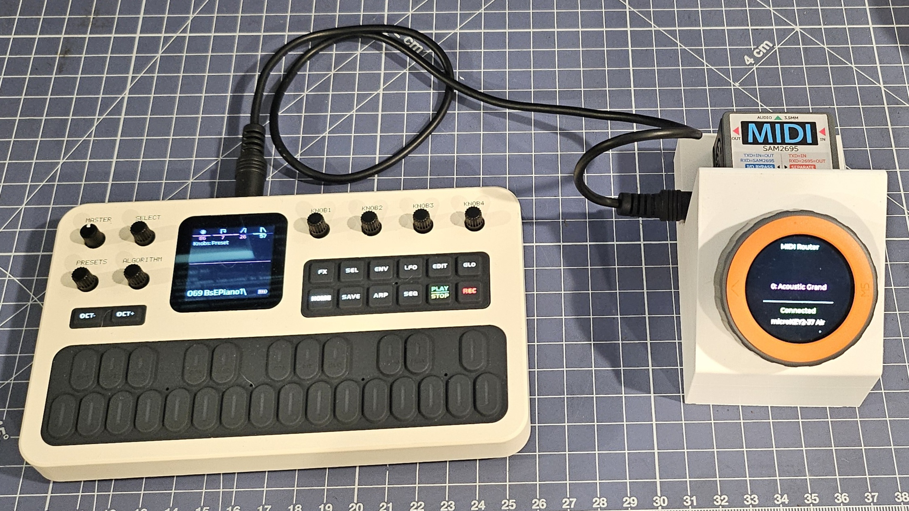

# m5dial_midi_router
MIDI Router for M5Dial, BLE, MIDI Unit

This device connects to a BLE MIDI keyboard (like a Korg Microkey Air), routes MIDI signals from the keyboard out to a TRS midi device (like a MVave FM1). It uses an M5stack MIDI unit for the TRS MIDI. That MIDI unit also has a SAM2695 synth built in, and this device makes use of that general-midi synth. I designed an enclosure that can be 3d printed, and attached the stl files for the enclosure and its bottom plate. I added this lithium battery ( https://www.amazon.com/dp/B0FRF6TT7H ), connected it to the 1.25mm JST connector in the M5Dial. I had to swap the pos/neg terminals on the battery connector. The M5Dial has a "B+" indicating which pin is positive. Be sure to set the M5 MIDI unit switch to "separate", not "I/O Bypass".

